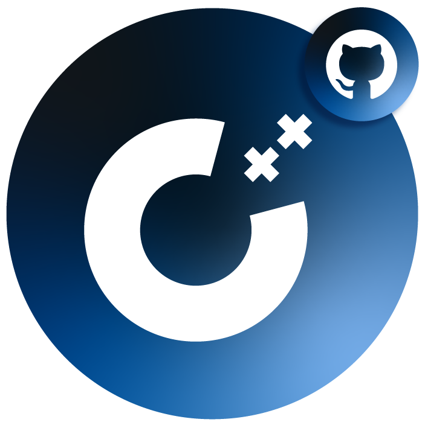

<div align="center">
    
    <br>
    <h1>C++ Starter Kit - Learn Fundamentals</h1>
    <p>Here, you'll find beginner-friendly programs tutorials, essential data structures, algorithms, and file operations. All with C++.</p>
</div>

---

> Universities prefer teaching programming fundamentals using C++ due to its efficiency, versatility, industry relevance, support for object-oriented programming principles, emphasis on memory management, and its role as a transitional language. C++ provides students with a solid foundation in low-level concepts, such as memory management and pointers, while also preparing them for a wide range of industries and programming domains. Its widespread use in industries like game development, systems programming, and scientific computing ensures that students acquire skills that are highly sought after in the job market. Additionally, C++ serves as a stepping stone for learning other languages, making it an ideal choice for introducing students to the core principles of programming.
> ([ChatGPT](https://chat.openai.com/share/b0cb4eda-0f9d-4b3b-aba1-d6887f08d3ac))

- [Overview](#overview)
  - [Why starting programming with c++](#why-starting-programming-with-c)
  - [Using C++ with VS Code](#using-c-with-vs-code)
- [Basic C++ Tutorials](#basic-c-tutorials)
  - [Data Types](#data-types)
    - [Example](#example)
    - [Resources](#resources)
  - [Basic Input and Output with `cin` and `cout`](#basic-input-and-output-with-cin-and-cout)
    - [Example](#example-1)
    - [Resources](#resources-1)
  - [Control Structures](#control-structures)
    - [Types of Control Structures](#types-of-control-structures)
    - [Resources](#resources-2)
- [Contributors ✨](#contributors-)

## Overview

### Why starting programming with c++
C++ is a middle-level programming language, positioned between high-level languages like Python add javaScript and low-level languages like Assembly. It inherits features from both. C++ has the ability to perform low-level operations like memory management, similar to the C language. This makes it a suitable choice for understanding these operations, especially since it is not as difficult to learn as C or other low-level languages. Additionally, C++ provides high-level features such as object-oriented programming (OOP) as well as standard library support for data structures and algorithms.

### Using C++ with VS Code
To use C++ with VS Code, you'll need a compiler. By default, VS Code doesn't support C++ compilers, so you must install one such as GCC. There are various methods to set this up, including using the Mingw-w64 executable or the `MSYS2` command-line interface (CLI). **See this resource**:
- [VS Code docs - Setting up MinGW for C++ Development in Visual Studio Code](https://code.visualstudio.com/docs/cpp/config-mingw)

## Basic C++ Tutorials

### Data Types

Data types exist in all programming languages, although there may be small differences between them. For example, in C++, number data types include `int`, `float`, and `double`, while in TypeScript, there's only the `number` data type for numbers. Data types define the kind of data that a variable can hold, such as integers, floating point numbers, characters, and more. Here are the basic data types in C++:

| Data Type | Description                                     | Size/Length  |
| --------- | ----------------------------------------------- | ------------ |
| `int`     | Used for integers                               | 2 or 4 bytes |
| `float`   | Used for floating point numbers                 | 4 bytes      |
| `double`  | Used for double sized floating point numbers    | 8 bytes      |
| `char`    | Used for single characters                      | 1 byte       |
| `bool`    | Used for boolean values (true/false)            | 1 byte       |
| `auto`    | Automatically detects data type (C++11 version) | Variable     |

#### Example

```cpp
// datatype variableName = value;
int x = 5;
char c = 'A';
bool isDone = true;
auto y = x; // int
```

#### Resources
- [W3Schools - C++ Data Types](https://www.w3schools.com/cpp/cpp_data_types.asp)

### Basic Input and Output with `cin` and `cout`
In C++, the standard library `iostream` is commonly included in most `.cpp` files to control input and output operations.

The `cin` object, along with the `>>` extraction operator, is utilized for input operations. It allows users to input data from the console into variables. On the other hand, the `cout` object, paired with the `<<` insertion operator, is used for output operations and displaying data on the console.

It's important to note that when interacting with `cin`, input values should not contain spaces, as a space typically signifies the end of an input task. To input an entire line of text, the `getline` function can be used, which will be introduced later.

Additionally, the `cerr` and `clog` objects of the `iostream` library classes, they are used for error and logging purposes.

#### Example

```cpp
// Declare an integer variable to store the user's input
int number;

// Display a prompt for the user to enter a number
cout << "Enter a number: ";

// Read the user's input from the console and store it in the 'number' variable
cin >> number;

// Display the entered number 
cout << "The number is: " << number << endl;
```

#### Resources 
- [GeeksforGeeks - Basic Input / Output in C++](https://www.geeksforgeeks.org/basic-input-output-c/)
- [Simplilearn - Understanding the Concept of Cin Object in C++ for Beginners](https://www.simplilearn.com/tutorials/cpp-tutorial/cpp-cin#:~:text=The%20C%2B%2B%20cin%20is%20an,extraction%20operator%20(%3E%3E).)
- [GeeksforGeeks - Difference between cerr and clog](https://www.geeksforgeeks.org/difference-between-cerr-and-clog/)

### Control Structures

Control structures are fundamental to every programming language. They dictate the flow of a program, determining how it executes instructions based on sequence, selection, and iteration.

#### Types of Control Structures

1. **Sequence Logic**:
   Sequence logic involves executing code in the order it's written, following a linear flow. Each line of code is executed in sequence, and any subsequent lines can override previous ones. For instance, setting a variable `x` to **0** and then setting it to **5** on the next line will result in `x` having a final value of **5**.

   ```cpp
   int x = 0;
   x = 5; // The program will take this value
   ```

2. **Selection Logic (Conditional)**:
   Selection logic means executing specific blocks of code based on some conditions. This is achieved using conditional statements such as `if`, `else if`, `else`, and `switch`.

   ```cpp
   bool isTrue = false;

   if (isTrue) {
       cout << "True"; // Will not be displayed
   } else {
       cout << "False"; // Will be displayed
   }
   ```

3. **Iteration Logic**:
   Iteration logic makes dynamic repetition through loops such as `while`, `for`, and `do while`. These loops repeatedly execute a block of code until a specific condition is met.

   ```cpp
   for (int i = 0; i < 5; i++) {
       cout << i << " ";
   }
   ```

   The code above will print numbers from 0 to 4 dynamically.

#### Resources

- [GeeksforGeeks - Control Structures in Programming Languages](https://www.geeksforgeeks.org/control-structures-in-programming-languages/)
- [W3Schools - C++ If ... Else](https://www.w3schools.com/cpp/cpp_conditions.asp)
- [Introduction to Iterators in C++](https://www.geeksforgeeks.org/introduction-iterators-c/)

---

## Contributors ✨

Thanks goes to these wonderful people ([emoji key](https://allcontributors.org/docs/en/emoji-key)):

<!-- ALL-CONTRIBUTORS-LIST:START - Do not remove or modify this section -->
<!-- prettier-ignore-start -->
<!-- markdownlint-disable -->
<table>
  <tbody>
    <tr>
      <td align="center" valign="top" width="14.28%"><a href="https://khaled.technway.biz/"><br /><sub><b>Khaled Alshibani</b></sub></a><br /><a href="https://github.com/khaledsAlshibani/cpp-starter-kit/commits?author=khaledsAlshibani" title="Code">💻</a> <a href="https://github.com/khaledsAlshibani/cpp-starter-kit/commits?author=khaledsAlshibani" title="Documentation">📖</a> <a href="#example-khaledsAlshibani" title="Examples">💡</a> <a href="#ideas-khaledsAlshibani" title="Ideas, Planning, & Feedback">🤔</a> <a href="#tutorial-khaledsAlshibani" title="Tutorials">✅</a></td>
    </tr>
  </tbody>
</table>

<!-- markdownlint-restore -->
<!-- prettier-ignore-end -->

<!-- ALL-CONTRIBUTORS-LIST:END -->

This project follows the [all-contributors](https://github.com/all-contributors/all-contributors) specification. Contributions of any kind welcome!